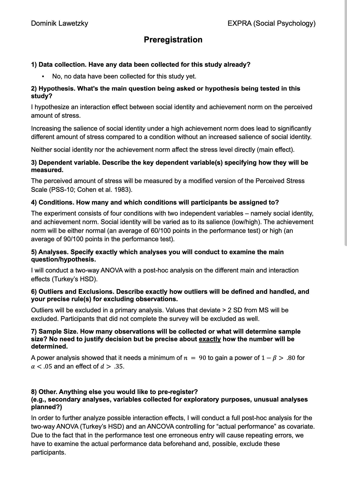
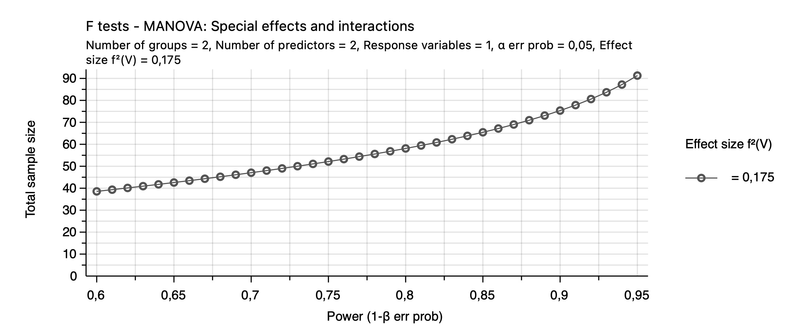
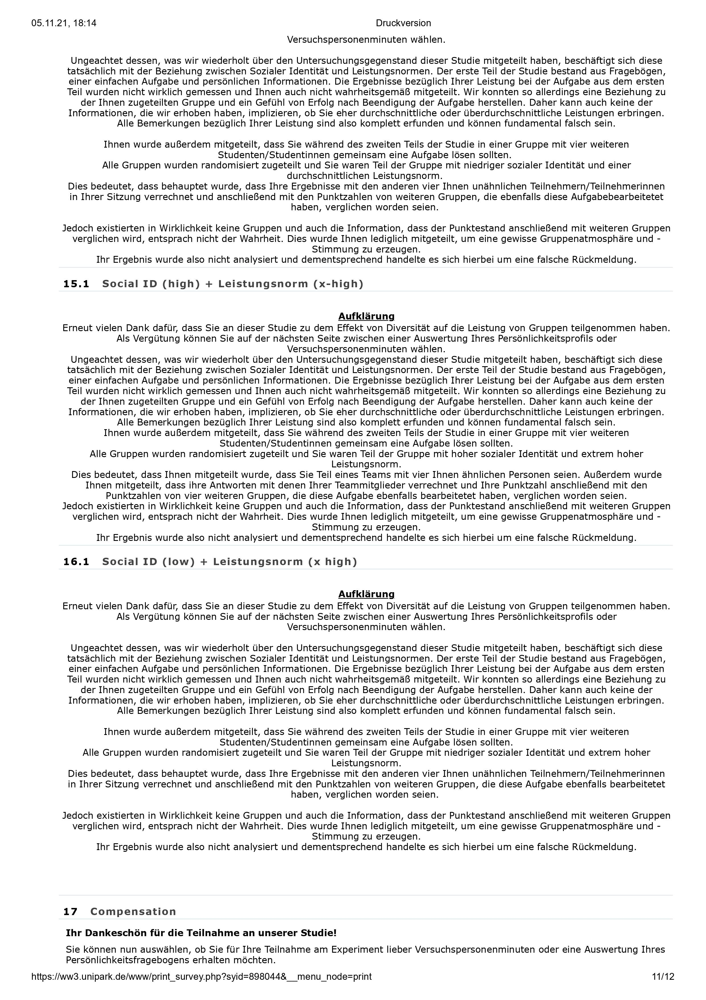

(ref:prereg) Preregistration.

\label{prereg}
```{r prereg, echo = FALSE, fig.cap = "(ref:prereg)", dev = "pdf", out.width = "75%", fig.align = "center", label = "prereg"}


```


(ref:power-analysis) Power analysis.

```{r power-analysis, echo=FALSE, fig.align="center", fig.cap="(ref:power-analysis)", warning=FALSE, dev="pdf", label= "power-analysis", out.width="100%"}


```

(ref:tests) Test battery.

\label{tests}

```{r tests, echo = FALSE, fig.cap = "(ref:tests)", dev = "pdf", out.width = "90%", fig.align = "center", label = "tests"}




```

(ref:qqplotanova) Q-Q-Plot for inspecting normality on the PSS-10.

```{r qqplotanova, echo = FALSE, fig.cap = "(ref:qqplotanova)", dev = "pdf", out.width = "90%", fig.align = "center", label = "qqplotanova"}
qqPlot(Selected_Data$stress_level,
       xlab = "Norm Quantiles",
       ylab = "Stress Level",
       grid = TRUE,
       id = FALSE,
       col = "#042A2B",
       col.lines = "#5EB1BF")
```

```{r anova-table, echo = FALSE, dev = "pdf", out.width = "100%", fig.align = "left", warning = FALSE, label = "anova-table"}

numformat <- function(x, digits = 2) { 
    ncode <- paste0("%.", digits, "f")
    sub("^(-?)0.", "\\1.", sprintf(ncode, x))
}

anova_data <- subset(Selected_Data, select = c(stress_level, Soc_Id, Soc_Norm))
anova_data$ID <- 1:nrow(anova_data)
anova_data <- anova_data %>% unite(condition, Soc_Id, Soc_Norm, sep = " / ", remove = F)

anova_data$stress_level <- outlier_sd(var = anova_data$stress_level, sd_diff = 2, drop = T, NA.replace = T, plot = F)
anova_data <- na.omit(anova_data)

colnames(anova_data) <- c("StressLevel", "Condition", "GroupIdentification", "AchievementNorm", "ID")

model <- ezANOVA(data = anova_data, dv = StressLevel, wid = ID, between = c(GroupIdentification, AchievementNorm), detailed = TRUE, type = 2, return_aov = TRUE)

anova <- model$ANOVA %>% data.frame

f <- effectsize::effectsize(model$aov, type = "f") %>% data.frame()

table <- data.frame(Condition = anova$Effect,
                    F = round(anova$F, 2),
                    p = numformat(anova$p, 3),
                    sig = anova$p..05, 
                    f_Cohen = round(f$Cohens_f_partial, 2),
                    f_CI = paste("[", paste(round(f$CI_low, 2), round(f$CI_high, 2), sep = ", "), "]", sep = ""))

table$Condition <- c("Group Identification", "Achievement Norm", "Interaction")

colnames(table) <- c("Predictor", "$F_{(1,125)}$", "$p$", "$p<.05$", "$f_{\\text{Cohen}}$", "$f_{\\text{Cohen}}$\\\ $90\\% ~ CI$")

apa_table(table, "Two-way ANOVA results with effect sizes.", booktabs = TRUE, escape = FALSE, align = c("l", "c", "c", "c", "c", "c"))

```

(ref:interaction) Interaction plot for group identification and social norm.

```{r interaction, echo = FALSE, fig.cap = "(ref:interaction)", dev = "pdf", out.width = "90%", fig.align = "center", warning = FALSE, label = "interaction"}
anova_data <- subset(Selected_Data, select = c(stress_level, Soc_Id, Soc_Norm))
anova_data$ID <- 1:nrow(anova_data)
anova_data <- anova_data %>% unite(condition, Soc_Id, Soc_Norm, sep = " / ", remove = F)

anova_data$stress_level <- outlier_sd(var = anova_data$stress_level, sd_diff = 2, drop = T, NA.replace = T, plot = F)
anova_data <- na.omit(anova_data)


ggplot(data = anova_data, aes(x = Soc_Id, group = Soc_Norm, 
                              color = Soc_Norm, y = stress_level)) + 
         stat_summary(fun = mean, geom = "point") +
         geom_smooth(method = "lm", fill = "#E0E0E0") +
         ylim(0, 5) +
         theme_ggstatsplot() +
         labs(x = "Group Identification",
              y = "Stress Level",
              color = "Achievement Norm") +
         scale_color_manual(values = c("#5EB1BF", "#FF595E")) +
         theme(legend.position = c(.95, .95),
               legend.justification = c("right", "top"),
               legend.box.just = "right",
               legend.margin = margin(6, 6, 6, 6))

```

(ref:simulation-plot1) Simulation of power for conservative outlier exclusion criterion. 

```{r simulation-plot1, echo = FALSE, fig.cap = "(ref:simulation-plot1)", dev = "pdf", out.width = "90%", fig.align = "center", warning = FALSE, label = "simulation-plot1"}

plot(simulation1$plot1)

```

(ref:simulation-plot2) Simulation of power for liberal outlier exclusion criterion. 

```{r simulation-plot2, echo = FALSE, fig.cap = "(ref:simulation-plot2)", dev = "pdf", out.width = "90%", fig.align = "center", warning = FALSE, label = "simulation-plot2"}

plot(simulation2$plot1)

```